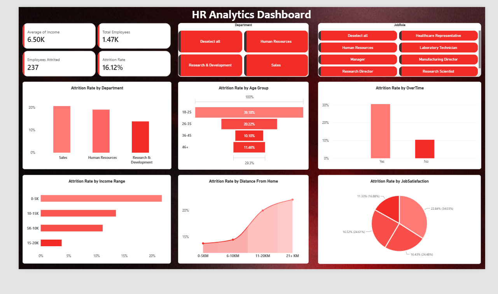

# HR Employee Attrition & Performance Analysis

## Project Overview
This project involves the analysis of the *IBM HR Analytics Employee Attrition & Performance* dataset to identify the key factors associated with employee attrition. Using SQL for data validation, cleaning and analysis along with Power BI for visualization, this project analyzes attrition across departments, age groups, income ranges, overtime, distance from home, and job satisfaction to understand which employee groups have higher attrition rates.

## Business Problem
A fictional dataset represents an organization that needs to understand the factors contributing to employee attrition so that HR teams and organizational leaders can take informed decisions to improve employee retention.

## Business Objective
- Identify the key factors associated with employee attrition.
- Analyze attrition patterns across different employee segments.
- Identify departments and employee groups with relatively higher attrition rates.
- Provide recommendations based on insights to support employee retention.

## Stakeholders
- HR Department
- Organizational Leaders
- Managers

## Datasets
**Source** - IBM HR Analytics Employee Attrition & Performance (Kaggle)  
**Link** - https://www.kaggle.com/datasets/pavansubhasht/ibm-hr-analytics-attrition-dataset  
**Size** - The employee data in this dataset is distributed across 35 columns.

## Tools Used
- SQL
- Power BI
- GitHub
- Visual Studio Code

## Data Cleaning
- Row count verification
- Duplicate detection
- Missing value assessment
- Invalid value validation

## Key Findings
- Total records: 1,470
- Employees attrited: 237
- Overall attrition rate: 16.12%
- Average monthly income: $6,503
- No duplicate employee records found.
- No NULL values detected in the validated columns.
- No invalid values found for Age, Monthly Income, or Distance From Home.

**The dataset passed all validation checks and was considered suitable for analysis.**

## Business Analysis
The following analyses were conducted to identify factors associated with employee attrition:

- Attrition by department
- Attrition by age group
- Attrition by overtime
- Attrition by income range
- Attrition by distance from home
- Attrition by job satisfaction

## Dashboard

## Insights
- Employees working overtime show a substantially higher attrition rate compared with employees who do not work overtime.
- Younger employees, particularly those aged 18–25, show the highest attrition rate among the analyzed age groups.
- Attrition varies across departments, with Sales showing the highest attrition rate, followed by Human Resources and Research & Development.
- Employees in the lowest income range show a relatively higher attrition rate compared with higher-income groups.
- Employees living farther from the workplace show higher attrition rates, with the 21+ KM group showing the highest rate.
- Employees with the lowest job satisfaction level show the highest attrition rate, while higher satisfaction levels generally show lower attrition.

## Recommendations
- HR should investigate workload and employee well-being among employees working overtime and consider workload management initiatives.
- Develop stronger career-development programs, mentorship, skill-building opportunities, and clear career progression for younger employees.
- HR should investigate high-attrition departments to identify department-specific issues such as workload, management, and compensation.
- Review compensation for lower-income employee groups and consider competitive pay, incentives, and growth opportunities.
- Consider flexible or hybrid work options and transportation support for employees with longer commuting distances.
- Conduct regular employee satisfaction surveys and address issues related to management, recognition, career growth, and workplace experience.

## Author
**Utkarsh Bisht**
